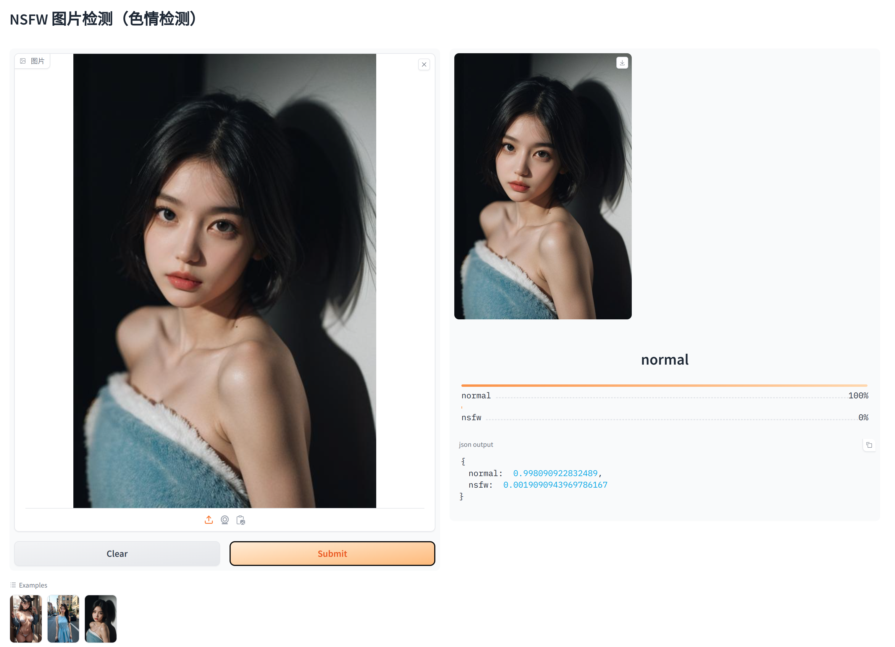

# NSFW检测 （色情检测）
> 使用huggingface上的nsfw模型，对 NSFW（工作不安全）图像进行分类。使其过滤各种应用程序中的露骨或不当内容。
> 
>  
> 
> [huggingface地址](https://huggingface.co/Falconsai/nsfw_image_detection)
> 
> 在Falconsai/nsfw_image_detection的基础上将其封装成api，并用gradio编写了一个简单的测试界面
> 
> api 测试详见项目api_test.py文件
> 
> 速度检测快，不用GPU还是很香的


## 使用方式一：python虚拟环境
> 安装 miniconda/anaconda

```bash
#clone项目
git clone https://github.com/a-zhui/nsfw_detection
#下载模型文件 模型文件较大（2.6G）
cd nsfw_detection #进入项目根目录
apt-get install git-lfs  #模型太大，以至于git仓库容纳不了。所以用git-lfs下载大文件
git lfs install
git clone https://huggingface.co/Falconsai/nsfw_image_detection
```

```bash
#构建虚拟环境
conda create -n nsfw_detection python=3.10
conda activate nsfw_detection

pip install torch
pip install transformers
pip install uvicorn
pip install gradio

```

```bash
#启动服务
uvicorn --host 0.0.0.0 --port 7860 main:app
```


## 使用方式二：docker
```bash
#拉取镜像  镜像较大12G
docker pull bocai123/nsfw_detection:V1.0
#docker pull registry.cn-hangzhou.aliyuncs.com/bocai123/nsfw_detection:V1.0 
#启动容器
docker run -it -d -p 8080:7860 --restart always --workdir /root/nsfw_detection --name nsfw_detection bocai123/nsfw_detection:V1.0 bash -c "bash init.sh"
#docker run -it -d -p 8080:7860 --restart always --workdir /root/nsfw_detection --name nsfw_detection registry.cn-hangzhou.aliyuncs.com/bocai123/nsfw_detection:V1.0 bash -c "bash init.sh"
```